# FinSight: Loan Portfolio Analytics and Forecasting

FinSight is a Python analytics project that explores consumer loan data, estimates default risk, forecasts monthly lending activity, and presents the results in a Streamlit dashboard and an HTML report.

## Datasets

This project uses two independent datasets for different analyses. They are not joined together.

### Loan Default Prediction Dataset

The `loan_default.csv` file contains about 255,000 loan records and 18 columns. It includes borrower and loan details such as age, income, loan amount, credit score, employment, loan purpose, and a `Default` outcome. FinSight uses this dataset for exploratory analysis and binary classification: predicting whether a record is labeled as default (`1`) or non-default (`0`). It does not contain the dated monthly history needed for the forecasting work.

Download: [Loan Default Prediction Dataset on Kaggle](https://www.kaggle.com/datasets/nikhil1e9/loan-default)

Save the downloaded file as `data/loan_default.csv`.

### Lending Club Accepted Loans, 2007–2018 Q4

The Lending Club file contains accepted loan applications and their recorded loan outcomes from 2007 through 2018 Q4. Relevant fields include the issue month (`issue_d`), loan status (`loan_status`), funded amount (`funded_amnt`), loan amount (`loan_amnt`), and purpose (`purpose`). FinSight uses these dated records to summarize loan purpose, build monthly portfolio measures, flag unusual months, and make six-month forecasts.

Download: [All Lending Club Loan Data on Kaggle](https://www.kaggle.com/datasets/wordsforthewise/lending-club)

Download `accepted_2007_to_2018Q4.csv.gz` and place it, still gzip-compressed, at `data/accepted_2007_to_2018Q4.csv.gz`. Kaggle may require an account to download the files. Follow the dataset page's terms for use and redistribution.

### How the monthly default rate is defined

The monthly Lending Club default rate is grouped by the month in which a loan was issued. It uses only loans with a resolved outcome: `Fully Paid` counts as non-default, while `Charged Off` and `Default` count as default. Current and late loans are excluded because their final outcome is not yet known. This is a resolved loan-vintage rate, not the number of defaults that happened during each calendar month.

## What the project does

1. **Explore loan characteristics.** Summarizes the classification dataset and creates charts for default distribution, numeric variables, age groups, loan amounts, and correlations.
2. **Estimate default risk.** Trains Random Forest and, when available, XGBoost classifiers on the `loan_default.csv` data. It compares their test-set results and saves the highest ROC-AUC model's feature importance and confusion matrix.
3. **Forecast portfolio KPIs.** Aggregates Lending Club loans by issue month and fits an ARIMA(2,1,2) time-series model to forecast the next six months of funded loan amount, loan count, and resolved default rate. Forecasts are clipped to valid non-negative values (and rates to 0–100%).
4. **Review loan-purpose segments.** Compares loan count, average loan amount, and resolved default rate by purpose. There is no reliable distribution-channel field in the data, so the analysis is by loan purpose rather than channel.
5. **Surface monitoring signals.** Flags monthly KPI values more than two standard deviations from their historical mean and applies simple rules to produce recommendations.
6. **Present results.** Produces charts in `reports/figures/`, an HTML report in `reports/output/`, and an interactive dashboard.

## Models

- **XGBoost classification:** Learns from borrower and loan fields in `loan_default.csv` to classify records as default or non-default. It is evaluated with classification metrics such as ROC-AUC, precision, and recall. Random Forest is trained as a second classifier for comparison.
- **ARIMA forecasting:** Fits monthly Lending Club history to forecast funded amount, loan count, and resolved default rate six months ahead. A time-ordered backtest holds out the last six observed months. It reports MAE and RMSE, plus MAPE for amount and loan count; MAPE is omitted for default rate because small rates make it misleading. Recent Lending Club vintages may have unresolved outcomes, so their observed default rates can understate eventual defaults. These forecast scores evaluate ARIMA only; XGBoost and ARIMA are not compared because they use different data and answer different questions.

### Default model results

Five-fold cross-validation ROC-AUC is measured on the training data; the table shows results on the separate 20% test split.

| Model | CV ROC-AUC (mean ± SD) | Test Accuracy | Test Precision | Test Recall | Test F1 | Test ROC-AUC |
|---|---:|---:|---:|---:|---:|---:|
| Random Forest | 0.7476 ± 0.0028 | 0.7339 | 0.2462 | 0.6260 | 0.3534 | 0.7537 |
| XGBoost | 0.7502 ± 0.0023 | 0.8863 | 0.5873 | 0.0703 | 0.1256 | 0.7565 |

### ARIMA six-month backtest results

These scores compare ARIMA predictions with the final six observed months. Default-rate errors are measured in percentage points; its MAPE is omitted because small actual rates make that metric unstable.

| KPI | MAE | RMSE | MAPE | Holdout months |
|---|---:|---:|---:|---:|
| Loan Volume | 36,420,260 | 41,368,140 | 5.202% | 6 |
| Loan Originations | 2,277.413 | 2,651.147 | 5.236% | 6 |
| Resolved Default Rate by Origination Month | 10.422 percentage points | 11.161 percentage points | N/A | 6 |

The forecasts are exploratory estimates, not guaranteed outcomes or lending decisions.

### Anomaly rules and recommendations

Monthly anomalies are flagged when a KPI's absolute z-score exceeds 2. Recommendations are rule-based summaries (for example, a sufficiently large loan-purpose group with a default rate above the portfolio average). They are prompts for investigation, not causal findings or automated lending decisions.

## Figures

The images below are generated by the project pipeline and stored in [`reports/figures/`](reports/figures/). Some files may be absent until the relevant pipeline stage has been run. The Lending Club figures describe the historic 2007–2018 data; they are not current market data.

### Default dataset: exploration and classification

**Target distribution** — counts of records labeled default and non-default. Class imbalance affects how accuracy should be interpreted.

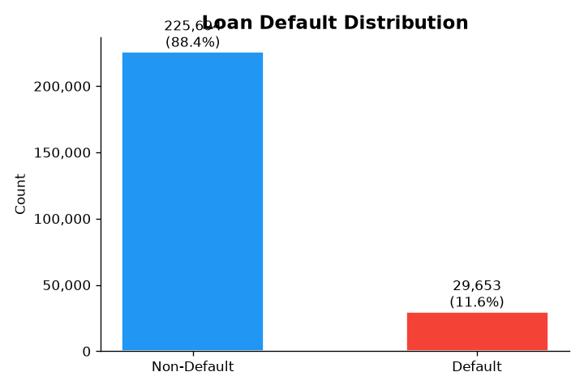

**Numeric distributions** — shows the spread and shape of numeric borrower and loan variables.

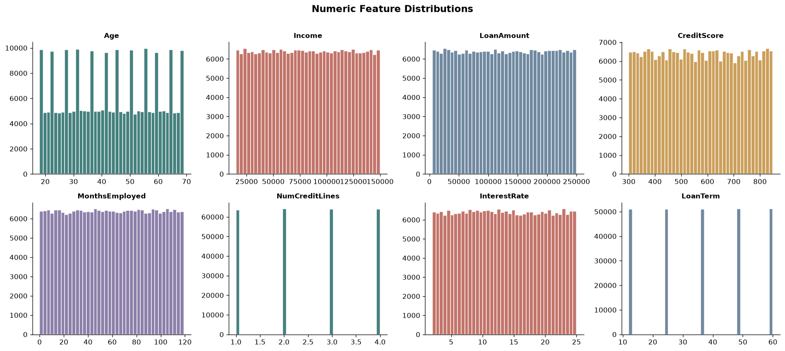

**Default rate by age** — compares the observed default share across age groups. This is descriptive and does not establish that age causes default.

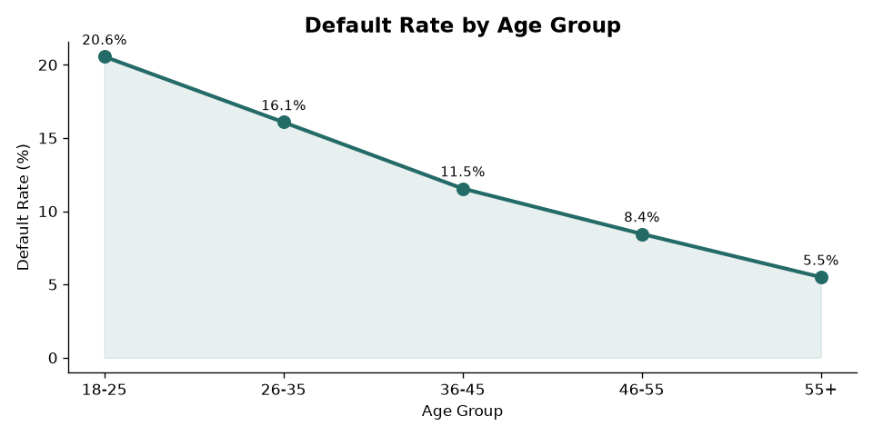

**Loan amount by default status** — compares loan amounts between default and non-default records.

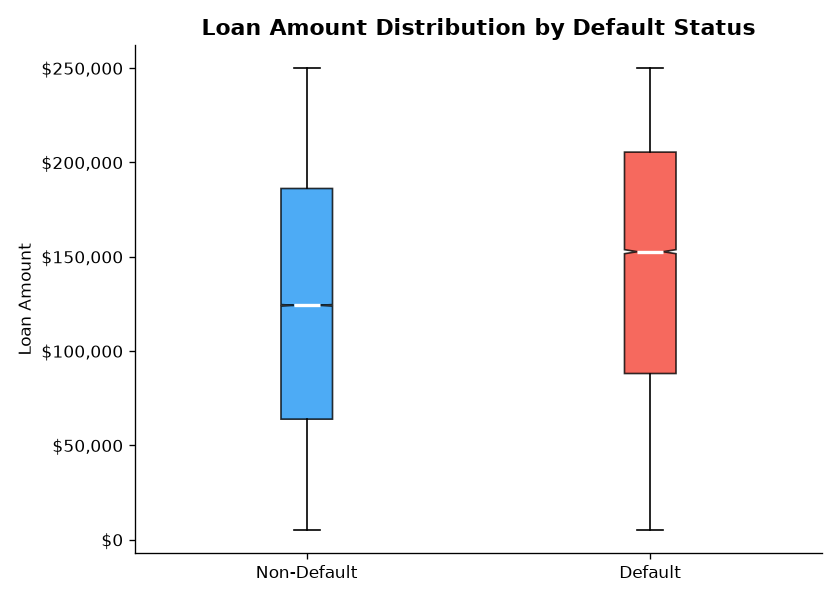

**Correlation heatmap** — shows pairwise linear correlations among numeric variables. Correlation alone does not establish causation.

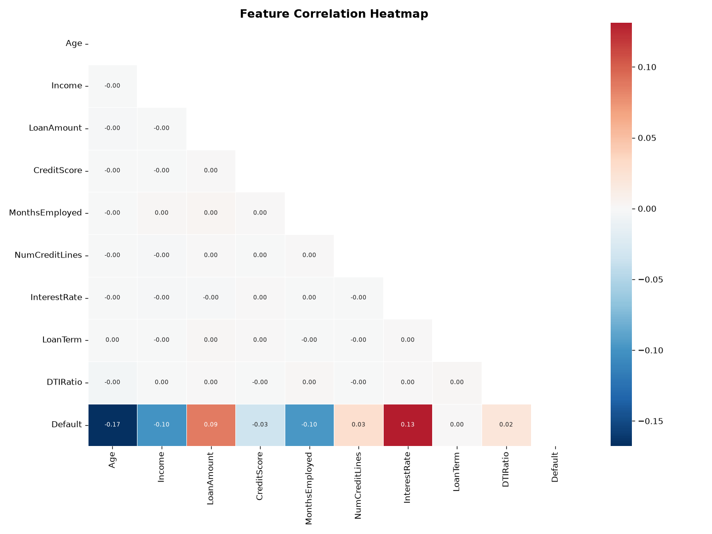

**ROC curves** — compares the classification models' true-positive and false-positive rates across thresholds; the legend reports ROC-AUC.

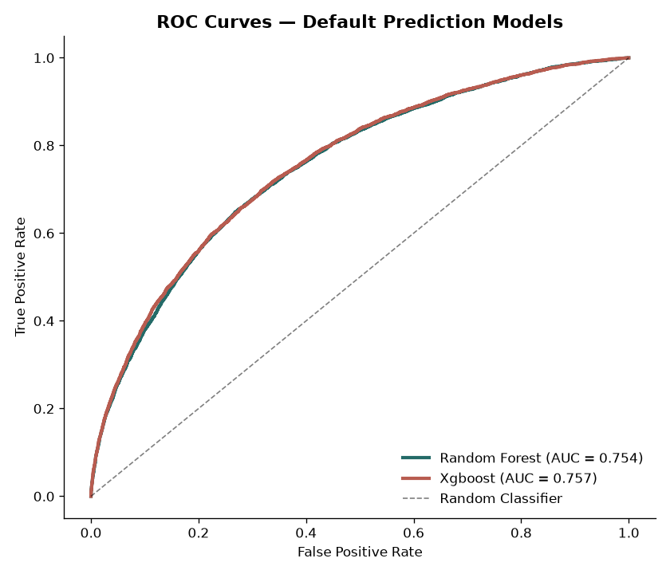

**Confusion matrix** — counts correct and incorrect default/non-default predictions for the selected model.

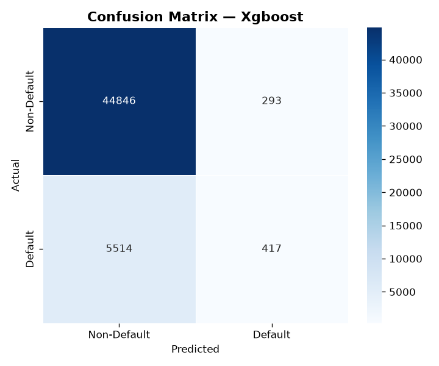

**XGBoost feature importance** — ranks the input features used by the fitted XGBoost model. Importance is predictive contribution, not causal effect.

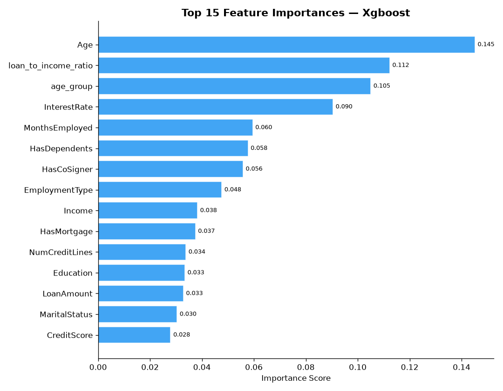

### Lending Club portfolio analysis and forecasts

**Loan volume forecast** — historical total loan amount by issue month followed by the ARIMA six-month projection.

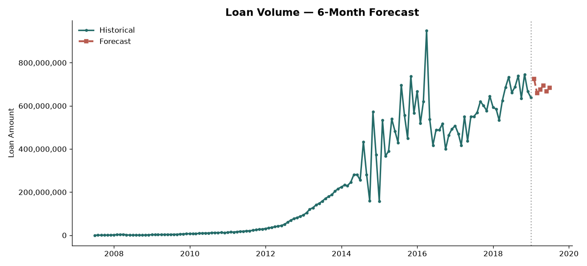

**Loan count forecast** — historical monthly loan originations and projected counts for the next six months.

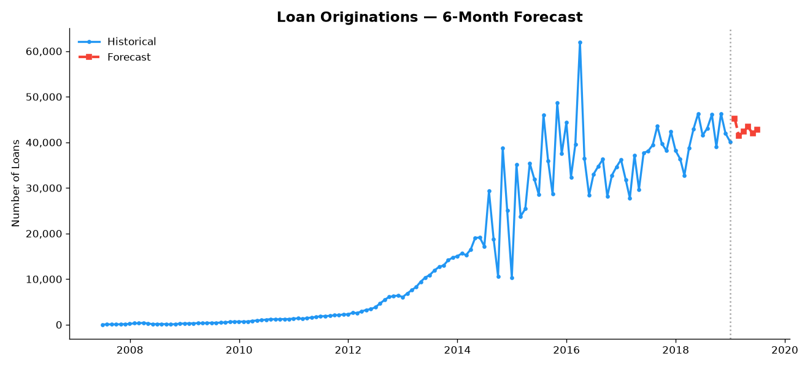

**Resolved default rate forecast** — issue-month default rate for loans with resolved outcomes, followed by its projection. A changing resolved-loan mix can affect this historical rate.

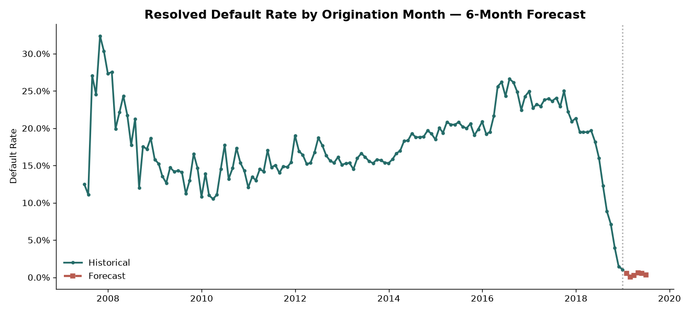

**Loan-purpose performance** — compares loan counts and resolved default rates across purposes.

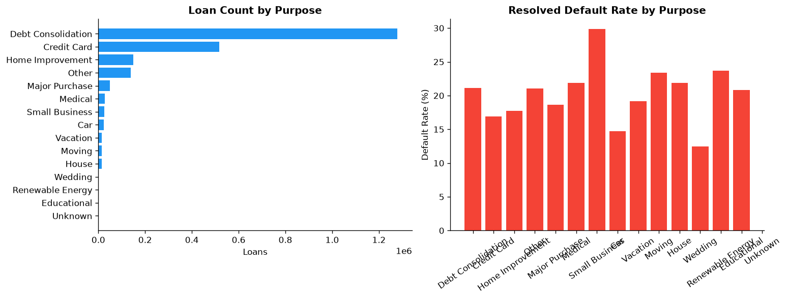

**Anomaly detection** — highlights months where funded amount is more than two standard deviations from its historical mean.

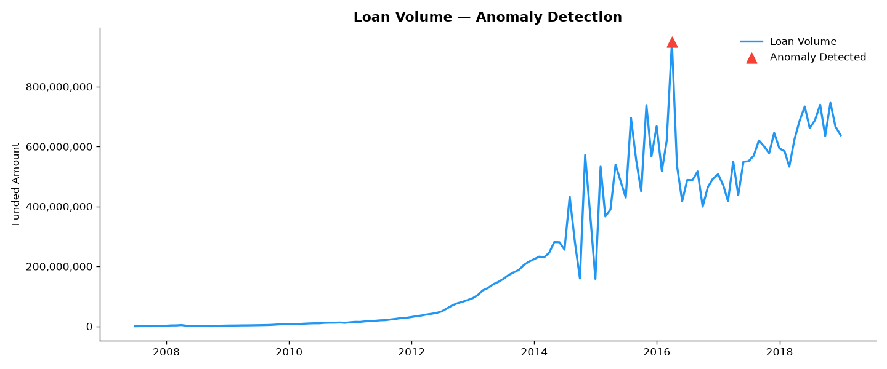

**Channel performance** — legacy figure retained in the figures folder. The current analysis uses loan purpose because the selected Lending Club columns do not provide a reliable channel field.

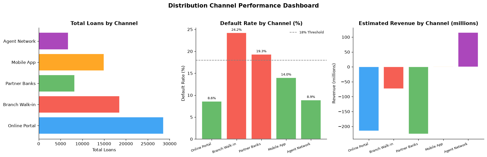

## Run locally

1. Clone this repository and place both downloaded datasets in `data/` using the filenames described above.
2. Create and activate a Python virtual environment.
3. Install dependencies and run either the complete pipeline or the dashboard:

```bash
pip install -r requirements.txt

# Generate EDA, forecasts, classification results, and the HTML report
python main.py

# Launch the interactive dashboard
streamlit run dashboard.py
```

The generated HTML report is written to `reports/output/business_performance_report.html`.

## Project structure

```text
data/
  data_loader.py             Load and prepare the default prediction dataset
  loan_default.csv           Download separately; not included in the repository
  accepted_2007_to_2018Q4.csv.gz  Download separately; not included in the repository
models/
  forecasting.py             Monthly KPI aggregation and ARIMA forecasts
  default_predictor.py       Random Forest and XGBoost classification
utils/
  eda.py                     Exploratory analysis charts
  insights.py                Loan-purpose analysis, anomaly flags, and rules
reports/
  figures/                   Generated and documented charts
  generate_report.py         Self-contained HTML report generator
dashboard.py                 Streamlit dashboard
main.py                      End-to-end pipeline runner
requirements.txt             Python dependencies
```

## Limitations

- The two datasets have different schemas and populations and are analyzed separately; classifier results are not used to produce the Lending Club KPI forecasts.
- The six-month ARIMA projections are a simple baseline. The project currently has no rolling backtest or forecast error scores, and no prediction interval.
- The classification preprocessing is intended for a portfolio demonstration. Imputation and category encoding happen before the train/test split, so a production evaluation should fit preprocessing only on training data, then apply it unchanged to test data.
- A model score is not a lending decision. Real use would require stronger validation, calibration, fairness review, monitoring, and domain oversight.
